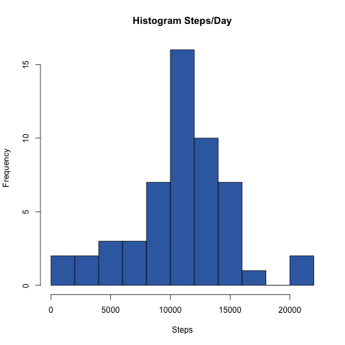
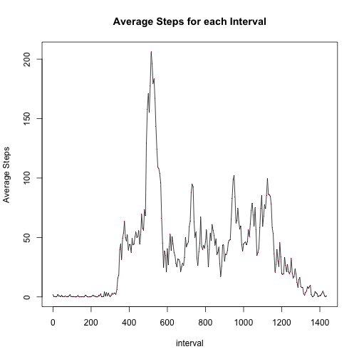
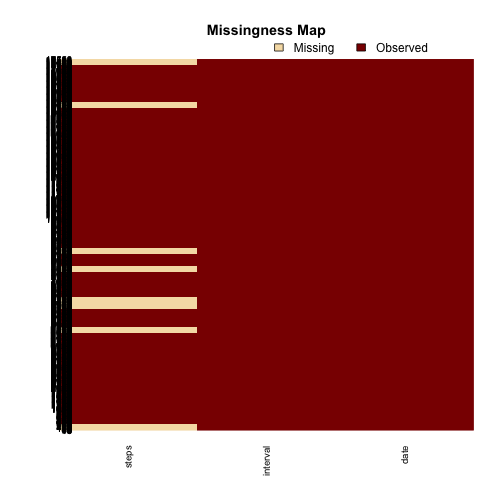
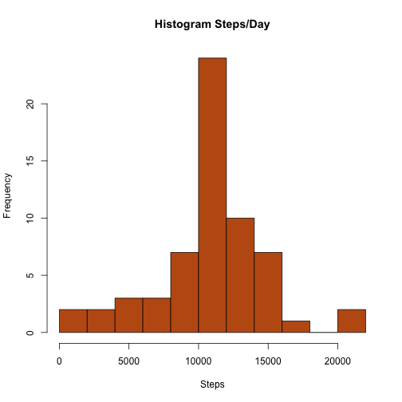
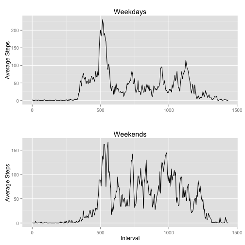

## Load necessary libraries

```r
library(dplyr)
```

```
## 
## Attaching package: 'dplyr'
## 
## The following objects are masked from 'package:Hmisc':
## 
##     src, summarize
## 
## The following object is masked from 'package:MASS':
## 
##     select
## 
## The following object is masked from 'package:stats':
## 
##     filter
## 
## The following objects are masked from 'package:base':
## 
##     intersect, setdiff, setequal, union
```

```r
library(lubridate)
library(RColorBrewer)
library(Amelia)
```

```
## Loading required package: Rcpp
## ## 
## ## Amelia II: Multiple Imputation
## ## (Version 1.7.3, built: 2014-11-14)
## ## Copyright (C) 2005-2015 James Honaker, Gary King and Matthew Blackwell
## ## Refer to http://gking.harvard.edu/amelia/ for more information
## ##
```

```r
library(gridExtra)
library(ggplot2)
library(stringr)
```

## prepare a color palette

```r
accent <- brewer.pal(8,"Accent")
```

## Loading and preprocessing the data

```r
data <- read.csv("activity.csv")
data <- mutate(data, date = ymd(date))
new_interval <- NULL
for(i in 1:288) new_interval=c(new_interval,as.integer((i-1)*5))
new_interval <- rep(new_interval, 61)
data <- mutate(data,interval=new_interval)
```

## What is mean total number of steps taken per day?
#### first get the total number of steps per day

```r
by_date <- group_by(data,date)
total <- summarise(by_date,total_steps = sum(steps))
```
#### plot a histogram

```r
hist(total$total_steps, main="Histogram Steps/Day",xlab="Steps",breaks=10,col=accent[5])
```

 

#### calculate the mean and median

```r
mean(total$total_steps,na.rm=TRUE)
```

```
## [1] 10766.19
```

```r
median(total$total_steps,na.rm=TRUE)
```

```
## [1] 10765
```

## What is the average daily activity pattern?
#### group the data by inteval, find the mean of each interval and plot

```r
by_interval <- group_by(data,interval)
avs <- summarise(by_interval, average_steps = mean(steps,na.rm=TRUE))
plot(avs,pch=".",main="Average Steps for each Interval",ylab="Average Steps",col=accent[6])
lines(avs)
```

 

#### find the interval that has the maximum number of steps

```r
index <- which.max(avs$average_steps)
avs$interval[index]
```

```
## [1] 515
```

## Imputing missing values
#### use Amelia package to visualize missing vales

```r
missmap(data,ylabel="")
```

 

#### there are only missing values in steps - so count the number missing

```r
sum(is.na(data$steps))
```

```
## [1] 2304
```
#### impute the missing values in steps using the mean for each 5 minute interval and put them in vector new

```r
new <- data$steps

for (n in 1:17568){
  if (is.na(data$steps[n])) {
    index <- which(avs$interval == data$interval[n])
    new[n] <- round(avs$average_steps[index])
  }
}
```

#### create new dataframe with the imputed values

```r
new_data <- data
new_data <- select(new_data,date,interval)
new_data <- mutate(new_data,steps = new)
```

#### plot a histogram of the new_data and get the mean and median

```r
new_by_date <- group_by(new_data,date)
new_total <- summarise(new_by_date,total_steps = sum(steps))
hist(new_total$total_steps, main="Histogram Steps/Day",xlab="Steps",breaks=10,col=accent[7])
```

 

```r
mean(new_total$total_steps)
```

```
## [1] 10765.64
```

```r
median(new_total$total_steps)
```

```
## [1] 10762
```

## Are there differences in activity patterns between weekdays and weekends?
#### make a new vector with weekday or weekend and add it to new_data dataframe

```r
w_end <- c(1,7)
wk_day <- ifelse(wday(new_data$date) %in% w_end,"weekend","weekday")
new_data <- mutate(new_data, day = as.factor(wk_day))
```

#### now group by interval and day and get the mean over the 5 intervals minute

```r
by_int_day <- group_by(new_data, interval, day)
ave_interval_by_int_day <- summarise(by_int_day,ave_steps = mean(steps))
w_days <- filter(ave_interval_by_int_day, day == "weekday")
w_ends <- filter(ave_interval_by_int_day, day == "weekend")
```

#### now plot them

```r
p1 <- qplot(interval,ave_steps,data=w_days,geom="line")
p1 <- p1 + labs(title="Weekdays",x="",y="Average Steps")

p2 <- qplot(interval,ave_steps,data=w_ends,geom="line")
p2 <- p2 + labs(title="Weekends",x="Interval",y="Average Steps")

grid.arrange(p1,p2,ncol=1)
```

 
